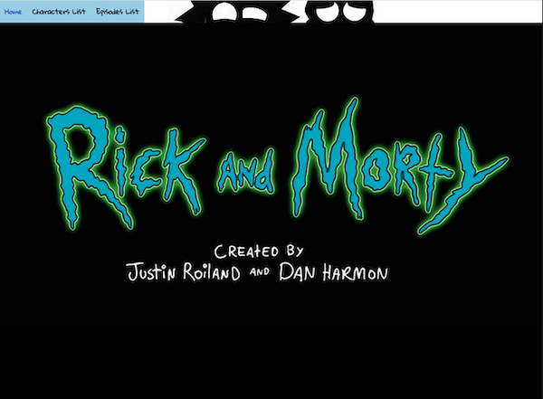
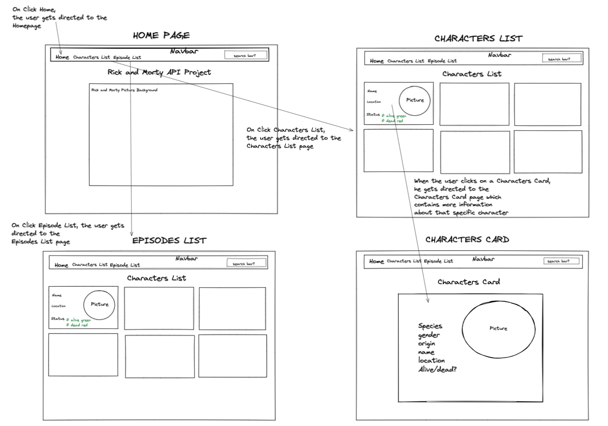
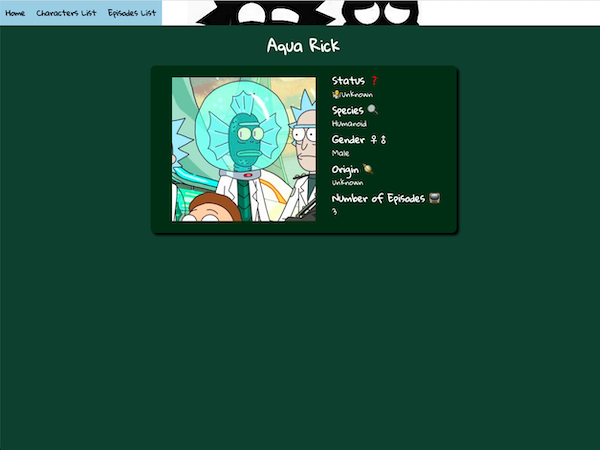
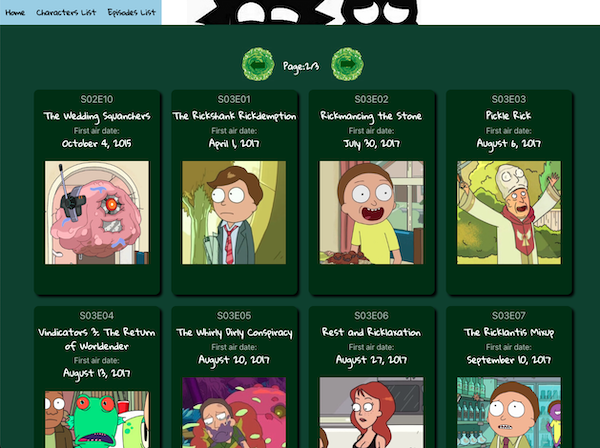
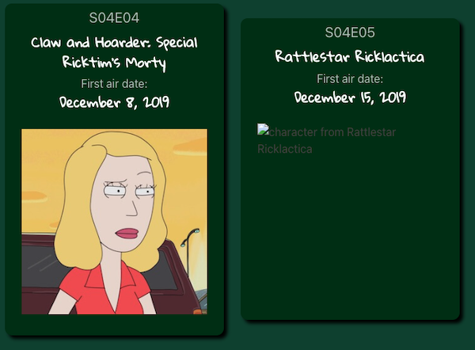
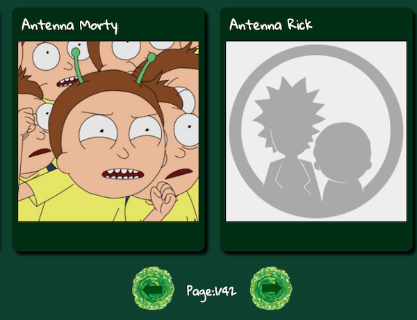

# THE RICK AND MORTY API PROJECT


## Project Description
Rick and Morty is an animated science-fiction sitcom created by Justin Roiland and Dan Harmon, it was first aired in 2013 and has a total of 6 seasons as of 2022.
This app consumes a public Rick And Morty API which contains Characters, Episodes, Locations and more. The app was built using React and contains 4 pages. Home, Characters List/Characters Bio, and Episodes List.

## Deployment Link
 [https://rick-morty-api-project.netlify.app/](https://rick-morty-api-project.netlify.app/ "The Rick & Morty API Project")
### API Link
 [ https://rickandmortyapi.com/api/]( https://rickandmortyapi.com/api/ "Rick and Morty API Link")


## Getting Started/Code Installation
Once the project is cloned onto your machine, follow these steps:
1. In the Project terminal, run the command `npm i react axios`.
2. Then run the command `npm start`.
3. Your default brower will open a new page and load the app.

### Dependencies
* Axios packages
* CORS packages
* Bulma library

## Timeframe 
This was a pair programing hackathlon with one of my fellow classmate Joel Sahiti using GitHub/Zoom/Slack and Visual Studio Code, to be completed in 48hrs.

## Technologies Used
* Excalidraw (wireframe)
* HTML/SASS/JavaScript
* React
* Visual Studio Code
* Postman
* Git/GitHub
* Axios packages
* CORS packages
* Bulma (SCSS library)
* Google Fonts
* Zoom
* Slack
* Netlify (deployment)


## Brief

### Requirements
* **Consume a public API** – this could be anything but it must make sense for your project.
* **Have several components** - At least one classical and one functional.
* **The app can have a router** - with several "pages".
* **Include wireframes** - designed before building the app.
* **Be deployed online** and accessible to the public.


## Planning


* Used Excalidraw to build a wireframe and design the basic layout of the app.
  * The wireframe shows 4 pages: Homepage, Characters List, Characters Card, Episodes List.
  * A navigation bar is used to navigate between each main pages.
  * One the Characters List page, if the user clicks on a Character's Card, he is directed.
  to a new page with the Character's card in the center of the screen and added information about him.
* Research an API with enough content to create a minimum of 3 pages.

## Build/Code Process

### Day One

* Installation
  * Created a new repository on GitHub and cloned it locally. (Alex/Joel)
  * Initial setup ot the React application using MacOs terminal. (Alex/Joel)
  * Installed Axios Packages and Bulma library. (Alex/Joel)

* Excalidraw  
  * Created a wireframe with each pages/components required of the app. (Alex/Joel)
  * API research (Alex/Joel)

### Characters List:

  * Created the `api.js` with the code (below) to fetch the required data based on our wireframe. (Alex/Joel)
  ```javascript
  import axios from 'axios';

  const BASE_URL = 'https://rickandmortyapi.com/api/character';
  const EPISODE_URL = 'https://rickandmortyapi.com/api/episode';

  export const getAllEpisodes = (pageNumber) =>
    axios.get(`${EPISODE_URL}/?page=${pageNumber}`);

  export const getAllCharacters = (pageNumber) =>
    axios.get(`${BASE_URL}/?page=${pageNumber}`);

  export const getCharacterBio = (characterId) =>
  axios.get(`${BASE_URL}/${characterId}`);

  ```
  * Created the NavBar (Joel)
  * Created Home and Characters List buttons. (Joel)
  * Created Characters List page and fetched data from API. (Alex)
  * As our API is only showing 20 characters per page, created pages button to 
show all characters. (Joel)

### Day Two

### Characters Bio:


  * Created Characters Bio page and fetched data from API. (Alex)
  * Maniuplated data to show a different icon for Characters Status depending on result. (Alex)

### Episodes List:


  * Created Episodes List Page. As we did not have images of each episodes, we decided
  to show random images of characters who appeared in that specific episode, see code below  (Alex/Joel)
  ```javascript
  import axios from 'axios';
  import { useState, useEffect } from 'react';

  const randomCharacter =
    characters[Math.ceil(Math.random() * characters.length)];

  useEffect(() => {
    axios.get(randomCharacter).then((res) => {
      console.log({ res });
      setDisplayCharacter(res.data.image);
    });
  }, []); 
  ```

  * Manipulated data to show how number of episodes for each character.(Alex)
  * Added syling to Navbar and Homepage. (Joel)
  * Added styling to Characters List and Bio. (Alex)
  * Deployed the project onto Netflify (Alex/Joel)


## Challenges
* Using Git/GitHub for the first time as a tool to collaborate slowed us down at the start however with some practice, we speeded up the process and reduced the amount of merging conflicts considerably.
* Using a CSS library for the first time also slowed down the styling of our app as we had
to read the documentation.

## Wins
* As our first project involving back-end programming and fetching and API, the process was highly enjoyable and our communication really helped getting things done in time.
* Use of CSS library made our styling simpler even though we lost valuable time in the process of reading the documentation.

## Key Learning/Takeways
* Pair-Programming 
* API fetching
* Use of Bulma (CSS library) for the first time 

## Bugs


* In the Episodes List page above, when an image does not load, the image `alt` is showed, however, what should show is a generic image such as the example below for Characters Card.




## Future Improvements
* Adding a condition in which second image is loaded onto a card if the fist image link is invalid.
* Adding a search function to the Navbar


## THANKS FOR READING!

